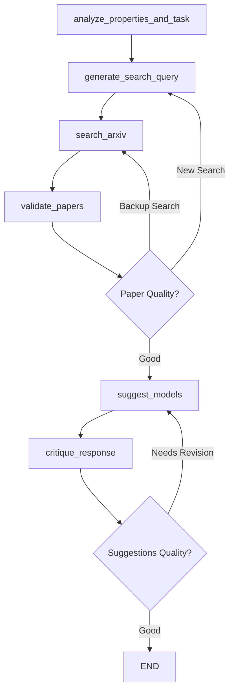
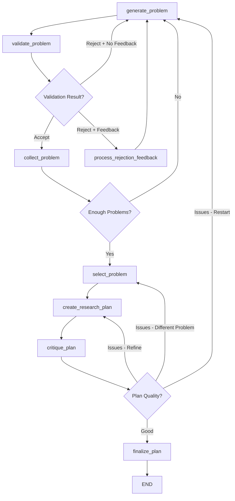
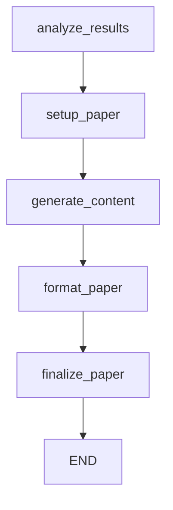
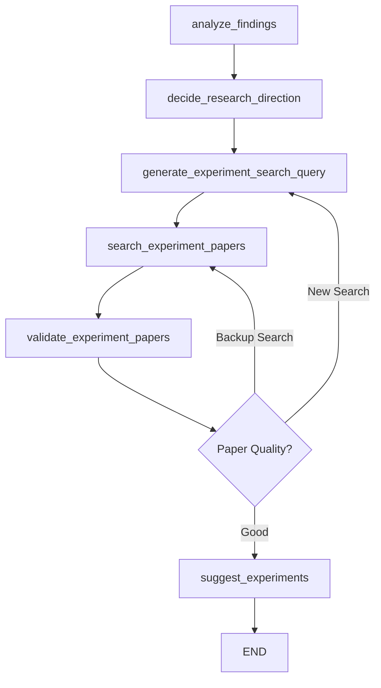

# ML Researcher Tool - Complete Flow Map

## 🏗️ **System Architecture Overview**

The ML Researcher Tool is a **multi-workflow LangGraph-based system** that automatically routes user requests to specialized pipelines based on intent analysis.

---

## 🚦 **MAIN ENTRY POINT & ROUTING**

```
User Input → Router Agent → Workflow Selection → Execution → Results
```

### **Entry Points:**
1. **Command Line Mode**: `python ml_researcher_langgraph.py "your query"`
2. **Interactive Mode**: `python ml_researcher_langgraph.py` (prompts for input)

### **Router Decision Logic:**
The router analyzes user prompts and routes to one of **4 specialized workflows**:

| **Workflow** | **Trigger Keywords/Patterns** | **Purpose** |
|--------------|-------------------------------|-------------|
| `MODEL_SUGGESTION` | "What model should I use?", "Recommend architectures", "Best approaches for X" | Technical implementation guidance |
| `RESEARCH_PLANNING` | "What are open problems?", "Research opportunities", "Create research plan" | Academic research planning |
| `PAPER_WRITING` | "Generate report from results", "Create paper", "Write up findings" | Paper/report generation |
| `EXPERIMENT_SUGGESTION` | "What should I try next?", "Plan follow-up experiments", "Which ablations to run?" | Experiment design guidance |

---

## 🔄 **WORKFLOW DETAILS**

### **1. MODEL SUGGESTION WORKFLOW**
*Purpose: Recommend ML models/architectures for specific tasks*



**Key Features:**
- **Concurrent Analysis**: Property extraction + task decomposition run in parallel
- **Optimized ArXiv Search**: 100 papers → async ranking → top 5 downloads
- **Domain-Specific Search**: Automatically infers research domain (CV, NLP, robotics, etc.)
- **Iterative Refinement**: Critique + revision loop for quality improvement
- **Robust Validation**: Papers validated for relevance before model suggestions

**State Tracking:**
- Property detection with confidence scores
- ArXiv search iterations and paper deduplication
- Model suggestion history and critique feedback
- Cumulative issue tracking (fixed/persistent/recurring)

---

### **2. RESEARCH PLANNING WORKFLOW**
*Purpose: Identify open problems and create research plans*



**Key Features:**
- **Smart Feedback Learning**: Processes rejection feedback to improve future generations
- **Iterative Problem Generation**: Continues until target number of validated problems
- **Web-based Validation**: Uses Google Search to verify problems are truly unsolved
- **Multi-level Critique**: Plan refinement at problem, plan, and fundamental levels
- **Quality Tracking**: Monitors score improvements and refinement attempts

**State Tracking:**
- Generated vs validated problem counts
- Rejection feedback accumulation
- Critique score history
- Plan revision iterations

---

### **3. PAPER WRITING WORKFLOW**
*Purpose: Generate research papers from experimental results*



**Key Features:**
- **Linear Pipeline**: Straightforward paper generation process
- **Multiple Formats**: Generates various output formats (Word, PDF, etc.)
- **Template-based**: Uses structured templates for different venues
- **Result Integration**: Processes experimental data into coherent narrative

**State Tracking:**
- Research analysis progress
- Section-by-section content generation
- Template configuration
- Quality scoring and revision count

---

### **4. EXPERIMENT SUGGESTION WORKFLOW**
*Purpose: Suggest follow-up experiments based on current findings*



**Key Features:**
- **Domain-Aware Analysis**: Automatically infers research domain from prompt/data
- **Contextual Literature Search**: Finds papers similar to current research (not generic methodology)
- **4-Term Structured Queries**: Domain + task + constraint + application format
- **Async Paper Ranking**: Same optimized pattern as model suggestion (100→rank→5)
- **Research Direction Guidance**: Helps decide next experimental steps

**State Tracking:**
- Findings analysis with domain classification
- Research context and domain inference
- Experiment categorization and prioritization
- Implementation roadmap generation

---

## 📊 **DATA FLOW & STATE MANAGEMENT**

### **State Objects:**
Each workflow maintains its own state with common base fields:

```python
class BaseState(TypedDict):
    messages: List[BaseMessage]        # LangGraph message history
    original_prompt: str               # User's original request
    current_step: str                  # Current workflow step
    errors: List[str]                  # Error accumulation
    workflow_type: str                 # Workflow identifier
```

### **Key State Features:**
- **Message History**: Full conversation context via LangGraph
- **Error Accumulation**: Tracks failures across workflow steps
- **Progress Tracking**: Current step identification for debugging
- **Cross-Node Data**: Persistent state between workflow nodes

---

## 🔧 **TECHNICAL IMPLEMENTATION**

### **Core Technologies:**
- **LangGraph**: State management and workflow orchestration
- **LiteLLM**: Multi-model LLM integration (Gemini, OpenAI, etc.)
- **Async Processing**: Concurrent operations for performance
- **ArXiv API**: Paper search and retrieval
- **FAISS**: Vector search for semantic retrieval
- **Google Search**: Web validation for research planning

### **Performance Optimizations:**
- **Parallel Processing**: Property extraction + task decomposition run concurrently
- **Async Paper Ranking**: ThreadPoolExecutor for paper evaluation
- **Semantic Chunking**: FAISS-based retrieval for large papers
- **Smart Caching**: Deduplication across search iterations
- **Fallback Handling**: Robust error recovery and alternative paths

### **Configuration:**
- **Model Selection**: Configurable via `env.example` file
- **API Integration**: LiteLLM proxy support for various providers
- **Rate Limiting**: Built-in handling for API constraints
- **Output Formats**: Multiple export options (JSON, Word, etc.)

---

## 🎯 **INPUT/OUTPUT PATTERNS**

### **Input Types:**
1. **Natural Language Queries**: "What model should I use for object detection?"
2. **Task Descriptions**: "I need to classify time series data with variable lengths"
3. **Experimental Results**: Raw data, metrics, logs for follow-up suggestions
4. **Research Contexts**: Domain-specific problems and constraints

### **Output Formats:**
1. **JSON Results**: Structured data with all workflow outputs
2. **Word Documents**: Formatted reports (research plans, papers)
3. **Interactive Display**: Console-based results with summaries
4. **File Exports**: Timestamped results saved to `Past_analysis/` directory

---

## 🚀 **USAGE PATTERNS**

### **Typical User Journeys:**

1. **Model Selection Journey:**
   ```
   User Query → Router → Model Suggestion → ArXiv Search → 
   Paper Validation → Model Recommendations → Critique → Final Suggestions
   ```

2. **Research Planning Journey:**
   ```
   User Query → Router → Research Planning → Problem Generation → 
   Web Validation → Problem Collection → Plan Creation → Critique → Final Plan
   ```

3. **Experiment Design Journey:**
   ```
   User Query → Router → Experiment Suggestion → Domain Analysis → 
   Literature Search → Paper Validation → Experiment Suggestions
   ```

---

## 📈 **QUALITY ASSURANCE**

### **Built-in Quality Controls:**
- **Multi-stage Validation**: Papers validated before use in recommendations
- **Critique Systems**: AI-powered feedback loops for continuous improvement
- **Confidence Scoring**: All outputs include confidence/quality metrics
- **Iteration Limits**: Prevents infinite loops in refinement cycles
- **Fallback Mechanisms**: Graceful degradation when components fail

### **Error Handling:**
- **Graceful Failures**: Continues workflow even if individual steps fail
- **Error Accumulation**: Tracks and reports all errors encountered
- **Alternative Paths**: Multiple routes to achieve workflow goals
- **Recovery Strategies**: Automatic retries and fallback options

---

## 🔮 **EXTENSIBILITY**

### **Adding New Workflows:**
1. Define new state class inheriting from `BaseState`
2. Create workflow graph with nodes and edges
3. Add routing logic to router agent
4. Implement workflow-specific nodes
5. Add to main execution logic

### **Customization Points:**
- **Model Selection**: Easy switching between LLM providers
- **Search Strategies**: Configurable ArXiv and web search parameters
- **Output Formats**: Extensible export system
- **Validation Logic**: Customizable quality criteria
- **Critique Systems**: Modular feedback mechanisms

---

## 💡 **KEY INNOVATIONS**

1. **Intelligent Routing**: Automatic workflow selection based on user intent
2. **Domain-Aware Search**: Context-sensitive literature retrieval
3. **Async Optimization**: Performance-optimized paper processing
4. **Smart Feedback**: Learning from rejection patterns in research planning
5. **Multi-Modal Output**: Various export formats for different use cases
6. **Robust State Management**: LangGraph-powered workflow orchestration

This tool represents a comprehensive ML research assistant that adapts to different research needs while maintaining high quality and performance standards.