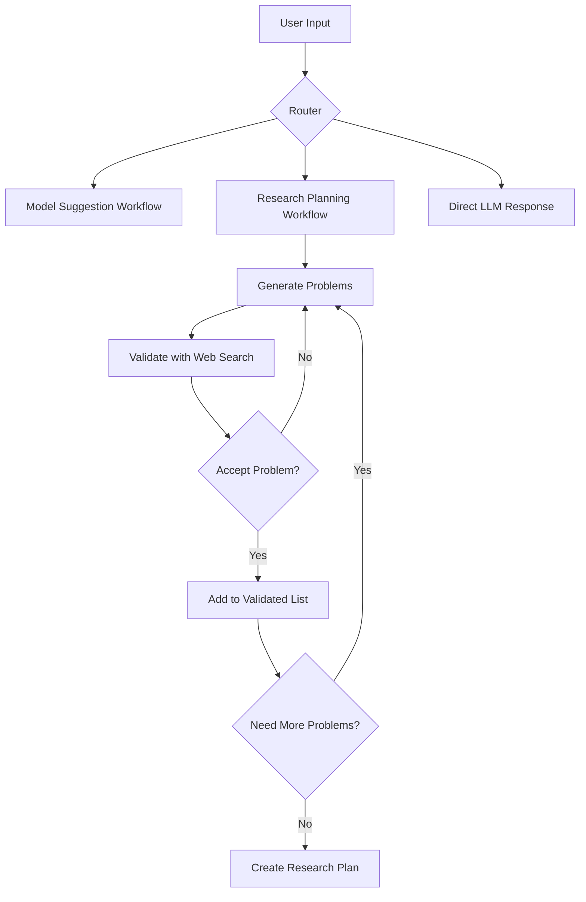

# ML Research Assistant (LangGraph) 🔬

A sophisticated LangGraph-powered research assistant that generates comprehensive research plans using multi-workflow architecture with real-time web search validation.

## 🌟 Key Features

- **Multi-Workflow Architecture**: Three specialized workflows (Router, Model Suggestion, Research Planning) built with LangGraph
- **Real-Time Web Search Validation**: Uses modular-search library to validate research problems against current literature
- **Interactive Workflow Visualization**: Mermaid diagrams for understanding system architecture
- **Comprehensive Research Plans**: Web-informed plans with actual URLs and current research state analysis
- **LiteLLM Integration**: Compatible with Gemini 2.5 Flash and other models via your proxy
- **Iterative Problem Generation**: Generates and validates multiple research problems before planning

## 🏗️ Architecture Overview

The system uses three main workflows orchestrated by LangGraph:

### 1. Router Workflow
Determines the best workflow path based on user input:
- Model/Tool recommendations → Model Suggestion Workflow
- Research planning → Research Planning Workflow
- General queries → Direct LLM response

### 2. Model Suggestion Workflow
Specialized for ML model and tool recommendations:
- Analyzes requirements and constraints
- Generates tailored model suggestions
- Provides implementation guidance

### 3. Research Planning Workflow
Advanced research plan generation with web validation:
- Generates multiple research problems iteratively
- Validates each problem using real-time web search
- Creates comprehensive plans incorporating web findings
- Includes actual URLs and current research state

## 📊 Workflow Diagrams

The system includes interactive workflow visualizations:



View interactive diagrams: Open `diagrams/workflow_viewer.html` in your browser

## 🚀 Quick Start

### 1. Install Dependencies

```powershell
pip install -r requirements.txt
```

### 2. Configure Environment

Set up your LiteLLM proxy configuration:

**Option A: Update env.example file (Recommended)**
```
OPENAI_API_KEY='your-actual-api-key-here'
BASE_URL='https://agents.aetherraid.dev'
DEFAULT_MODEL='gemini/gemini-2.5-flash'
```

**Option B: Environment variables**
```powershell
$env:OPENAI_API_KEY = "your-api-key-here"
$env:BASE_URL = "https://agents.aetherraid.dev"
$env:DEFAULT_MODEL = "gemini/gemini-2.5-flash"
```

### 3. Run the LangGraph Assistant

```powershell
python ml_researcher_langgraph.py
```

## 💡 Usage Examples

### Research Planning with Web Validation
```powershell
# The system will:
# 1. Generate multiple research problems
# 2. Validate each using real-time web search
# 3. Create comprehensive plan with actual URLs

python ml_researcher_langgraph.py
# Enter: "I want to research anomaly detection in time series data"
```

### Model Recommendations
```powershell
python ml_researcher_langgraph.py
# Enter: "What's the best model for image classification with limited data?"
```

### View Workflow Diagrams
```powershell
# Generate fresh diagrams
python generate_mermaid_diagrams.py

# View in browser
start diagrams/workflow_viewer.html  # Windows
# or open diagrams/workflow_viewer.html  # macOS/Linux
```

## 🔍 Web-Enhanced Research Planning

The LangGraph version includes advanced web search integration:

### What Makes It Special
- **Real-Time Validation**: Each research problem is validated using Google Search via modular-search
- **Current Research State**: Analyzes actual search results to determine if problems are open/solved
- **URL Integration**: Research plans include actual URLs for immediate literature review
- **Research Gap Analysis**: Identifies gaps based on search result density and content

### Web Search Integration Details
```python
# Example validation output:
{
    "status": "partially_solved",
    "confidence": 0.85,
    "web_search_performed": True,
    "search_results_count": 47,
    "relevant_urls": [
        "https://arxiv.org/abs/2023.12345",
        "https://github.com/research-group/anomaly-detection",
        "https://ieee.org/papers/neural-anomaly-2024"
    ],
    "web_findings": "High activity in research area suggests established field...",
    "existing_approaches": ["LSTM-based detection", "Transformer models"]
}
```

## 📋 Research Plan Structure

Enhanced plans now include:

1. **Executive Summary** - Web-informed overview with research activity assessment
2. **Web-Informed Problem Prioritization** - Based on actual search results
3. **Phase 1: Foundation & Literature Review** - Starting with discovered URLs
4. **Phase 2: Problem Formulation** - Leveraging web-found resources
5. **Phase 3: Active Research** - Building on existing approaches
6. **Phase 4: Evaluation & Synthesis** - Benchmarked against current state
7. **Web-Informed Resource Requirements** - Based on state-of-the-art findings
8. **Success Metrics** - Compared against existing research

## 🛠️ System Requirements

- Python 3.8+
- LiteLLM proxy access
- Internet connection (for web search validation)
- Required packages: `langgraph`, `modular-search`, `openai`, etc.

## 📁 File Structure

```
├── ml_researcher_langgraph.py     # Main LangGraph application
├── generate_mermaid_diagrams.py   # Workflow visualization generator
├── diagrams/                      # Generated workflow diagrams
│   ├── router_workflow.mmd
│   ├── model_suggestion_workflow.mmd
│   ├── research_planning_workflow.mmd
│   └── workflow_viewer.html       # Interactive diagram viewer
├── requirements.txt
└── README.md
```

## 🎯 Example Research Topics

The LangGraph system excels at these types of queries:

- **"I want to research anomaly detection in IoT sensor networks"**
  - Generates 3-5 specific research problems
  - Validates each against current literature
  - Creates plan with actual research URLs

- **"What's the best approach for few-shot learning in medical imaging?"**
  - Analyzes model requirements and constraints
  - Suggests specific architectures and techniques
  - Provides implementation guidance

- **"Help me plan research on graph neural networks for drug discovery"**
  - Web-validated problem identification
  - Current research state analysis
  - Comprehensive 24-month research roadmap

## 🚨 Troubleshooting

### Common Issues

**LangGraph Import Errors**
```powershell
pip install --upgrade langgraph
```

**Web Search Failures**
```powershell
pip install modular-search
# Ensure internet connectivity for validation
```

**API Configuration**
- Verify LiteLLM proxy is running at your BASE_URL
- Check API key has sufficient credits
- Test connection: `curl https://agents.aetherraid.dev/health`

**Workflow Visualization**
```powershell
# Regenerate diagrams if corrupted
python generate_mermaid_diagrams.py

# View diagrams
start diagrams/workflow_viewer.html
```

## 🔧 Advanced Configuration

### Custom Workflow Parameters
Modify `ml_researcher_langgraph.py` to adjust:
- Number of research problems generated (default: 3-5)
- Web search result limits (default: 10 URLs per problem)
- Validation confidence thresholds (default: 0.7)
- Research plan complexity levels

### Performance Optimization
- Use faster models for problem generation: `gemini/gemini-1.5-flash`
- Adjust parallel processing in web search validation
- Cache validation results for repeated queries

## 📊 Output Examples

### Research Plan Structure
```markdown
# Comprehensive Research Plan: Anomaly Detection in IoT Networks

## EXECUTIVE SUMMARY
- 4 web-validated open problems identified
- High research activity (avg 23 search results per problem)
- 12 relevant URLs discovered for immediate follow-up

## WEB-INFORMED PROBLEM PRIORITIZATION
1. **Real-time edge computing anomaly detection** (Status: partially_solved, 31 URLs)
2. **Federated anomaly detection for IoT** (Status: open, 8 URLs)
...

## PHASE 1: FOUNDATION & LITERATURE REVIEW (Months 1-3)
- Start with discovered URLs:
  1. https://arxiv.org/abs/2023.anomaly-iot
  2. https://github.com/iot-research/anomaly-detection
- Focus on existing approaches: LSTM-based, federated learning, edge computing
...
```

## 🤝 Contributing

The LangGraph architecture makes it easy to add new workflows:

1. **Add New Workflow**: Create new StateGraph in `ml_researcher_langgraph.py`
2. **Update Router**: Modify routing logic to include your workflow
3. **Generate Diagrams**: Run `python generate_mermaid_diagrams.py`
4. **Test Integration**: Ensure proper state management between workflows

## 📜 License

This project is open source and available under the MIT License.

---

**🚀 Ready to start?** Run `python ml_researcher_langgraph.py` and experience the future of AI-powered research planning!
