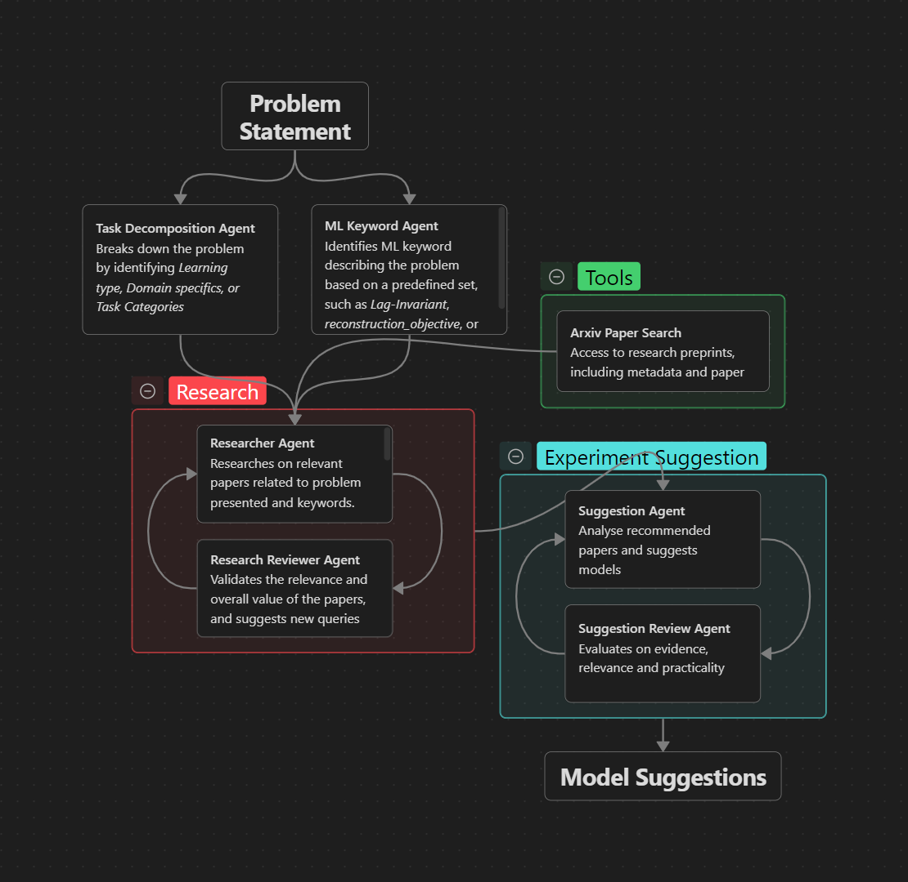
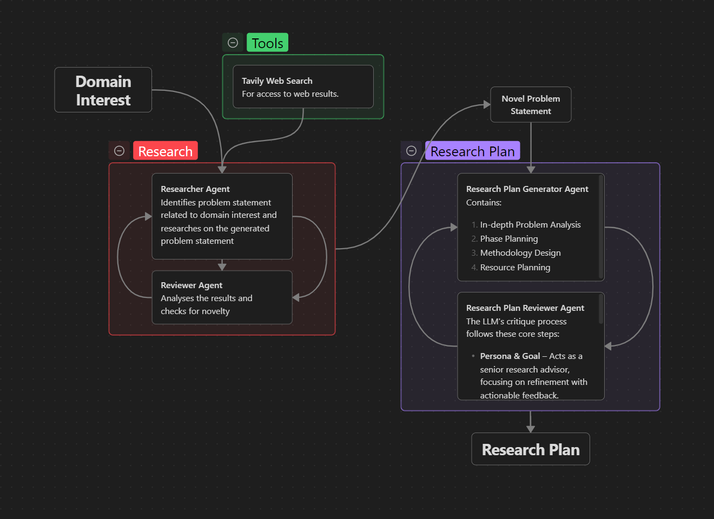
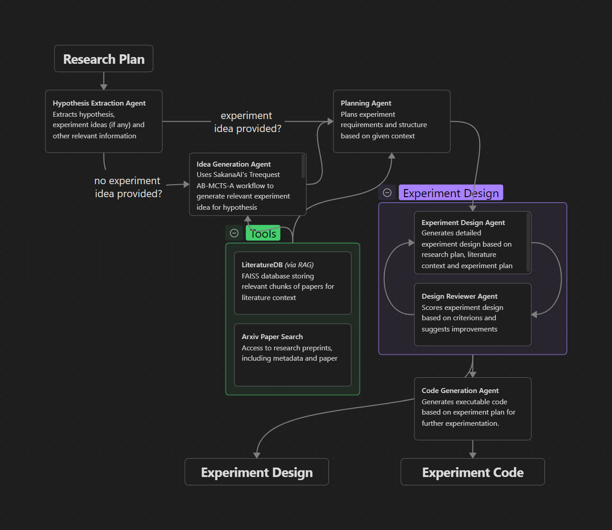
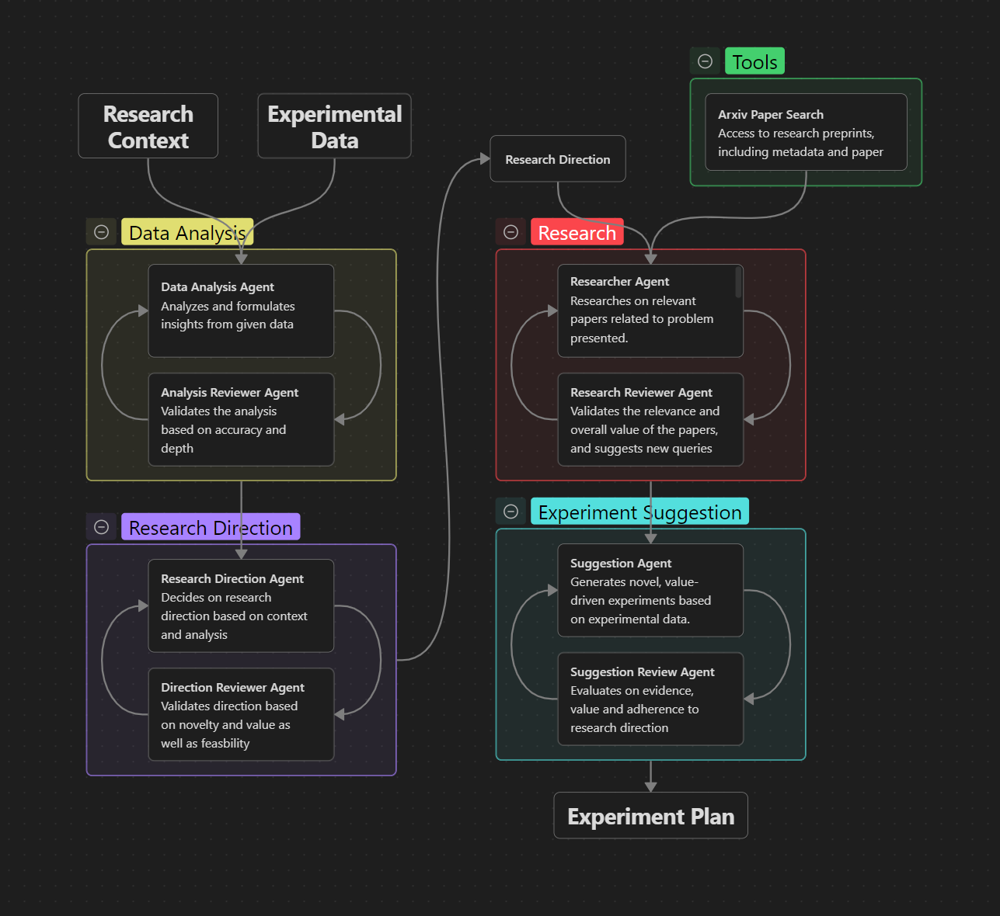
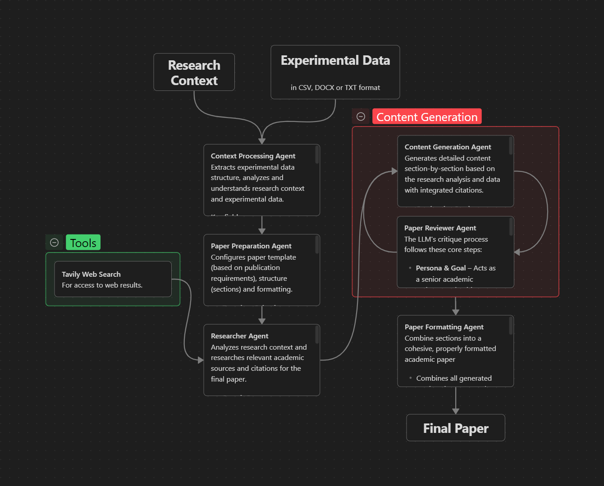

# AERO: Automated Exploration, Research & Orchestration – A Framework for Machine Learning Research

AERO is a modular, end-to-end framework designed to streamline and enhance machine learning research. It consists of **five main workflows** that collectively support the research lifecycle, from problem formulation to publication. The system leverages Large Language Models (LLMs) within a graph-based orchestration engine (LangGraph) to enable flexible, interpretable, and automated guidance for researchers, ensuring that each stage of the workflow is context-aware and informed by prior knowledge.


## 📝 Abstract
Machine learning researchers often face significant challenges in conducting end-to-end research due to the complexity of modern problems, the rapidly growing volume of literature, and the multi-step nature of tasks such as model selection, experiment design, data analysis, and paper writing. In recent years, Large Language Models (LLMs) have shown remarkable capabilities in knowledge extraction, reasoning, code generation, and summarization, making them well-suited to assist researchers across these tasks. A modular architecture is ideal, where core LLM capabilities operate independently of any specific workflow, enabling flexible orchestration and integration.

We propose AERO, a modular and adaptable framework for machine learning research, which integrates LLMs as a core component and orchestrates five main workflows: **model recommendation, research planning, experiment design, data analysis, and paper writing**. This modular and adaptable approach highlights the value of LLM-driven workflows in supporting efficient, systematic, and context-aware machine learning research.


---

## 🛠️ Installation and Set-Up

### Installing from PyPI

Yes, we have published our framework on PyPI! To install the aero library and all its dependencies, the easiest method would be to use `pip` to query PyPI. This should, by default, be present in your Python installation. To, install run the following command in a terminal or Command Prompt / Powershell:

```bash
$ pip install aero
```

Depending on the OS, you might need to use `pip3` instead. If the command is not found, you can choose to use the following command too:

```bash
$ python -m pip install aero
```

Here too, `python` or `pip` might be replaced with `py` or `python3` and `pip3` depending on the OS and installation configuration. If you have any issues with this, it is always helpful to consult 
[Stack Overflow](https://stackoverflow.com/).

### Installing from Source

Git is needed to install this repository from source. This is not completely necessary as you can also install the zip file for this repository and store it on a local drive manually. To install Git, follow [this guide](https://git-scm.com/book/en/v2/Getting-Started-Installing-Git).

After you have successfully installed Git, you can run the following command in a terminal / Command Prompt:

```bash
$ git clone https://github.com/aether-raid/aero.git
```

This stores a copy in the folder `aero`. You can then navigate into it using `cd aero`. Then, you can run the following:

```bash
$ pip install .
```

This should install `aero` to your local Python instance.

### Contributing

If you are contributing, please clone this repository:

```bash
$ git clone https://github.com/aether-raid/aero.git
```

Thereafter, use `uv` to sync dependencies as follows:

```bash
$ uv sync
```

This will initiate a `.venv/` directory in the repository root directory, which can then be used as the Python Environment for development purposes. Please follow the [`uv` documentation](https://docs.astral.sh/uv/) for detailed steps on how to use `uv` for development.


### Configuring Environment Variables

Copy the provided `.env.example` file to `.env`:

```bash
cp .env.example .env
```

Open `.env` and fill in your own API keys and settings:

```
OPENAI_API_KEY='YOUR_OPENAI_KEY'
BASE_URL='YOUR_BASE_URL'
DEFAULT_MODEL='gemini/gemini-2.5-flash'
GOOGLE_API_KEY='YOUR_GOOGLE_KEY'
CX='YOUR_CUSTOM_SEARCH_CX'
TAVILY_API_KEY='YOUR_TAVILY_API_KEY'
```

**Do not** commit your real `.env` file to version control. The `.env.example` file is safe to share and shows users what variables they need.

---

## 🚀 Running the Workflows

### 1. Model Recommendation 🤖
Given a research task description, the system analyzes the problem characteristics, searches for relevant literature, and recommends the most suitable machine learning models. The final output includes model suggestions with detailed justifications, implementation considerations, and literature references.

#### Using it as a Python module:
You can import and use the workflow in your own Python scripts:
   ```python
    from Suggest_models.model_suggestion_nodes import run_model_suggestion_workflow

    result = await run_model_suggestion_workflow(user_input)
    print(result["model_suggestions"]["model_suggestions"])
   ```

#### General Workflow:
1. **Task Analysis**: Extracts research properties and decomposes the task into ML categories (classification, regression, generation, etc.) using predefined ML research categories.
2. **Literature Search**: Generates optimized arXiv search queries and retrieves relevant research papers using semantic search and relevance ranking.
3. **Paper Validation**: Filters and validates retrieved papers for methodological relevance and quality.
4. **Model Suggestion**: Analyzes papers and task characteristics to recommend suitable ML models with detailed justifications.
5. **Critique & Refinement**: LLM-based quality assessment with iterative improvement based on critique feedback (up to 4 iterations).
6. **Final Recommendations**: Produces comprehensive model suggestions with implementation details, performance expectations, and literature citations.



### 2. Research Planning
blah blah



### 3. Experiment Design 🧪
Given a research plan, the system extracts key information and retrieves supporting literature to generate experiment ideas and designs. The final output is a detailed experimental design accompanied by executable Python code.

#### Using it as a Python module:
You can import and use the workflow in your own Python scripts:
   ```python
    from design_experiment import run_experiment_designer # Full Workflow 
    from design_experiment import experiment_designer # (Optional) Langgraph Only 

    result = run_experiment_designer(user_input)
    print(result["design"])
    print(result["code"])
   ```

#### General Workflow:
1. Input Processing: Extracts goals, hypotheses, experiment ideas (if provided), and other relevant details from a research plan.
2. Literature Retrieval System: Uses a Hybrid-RAG (Retrieval-Augmented Generation) approach to search and retrieve supporting literature (arXiv API).
3. Idea Generation: Employs [SakanaAI’s Tree-based Experimentation Module](https://github.com/SakanaAI/treequest) to generate promising experiment ideas (when no experiment idea is provided).
4. Design Refinement: Refines experiment ideas into structured experiment designs that include:
   - Datasets
   - Methodologies and implementation steps
   - References
   - Additional supporting details
5. Scoring and Refinement System: Evaluates and refines experiment designs based on key criterions to ensure quality, completeness, and relevance.
6. Code Generation: Produces minimal executable Python code after syntax validation and import checks 




### 4. Data Analysis & Suggest Experiments 🧪
Given experimental results and research context, the system analyzes findings, determines research direction, searches for supporting literature, and generates comprehensive experiment suggestions. The final output includes detailed experimental designs with literature grounding and iterative validation.

#### Using it as a Python module:
You can import and use the workflow in your own Python scripts:

**Basic Usage:**
   ```python
    from suggest_additional_experiments import suggest_experiments

    result = await suggest_experiments(
        "I completed CNN experiments for image classification",
        experimental_results={"model_performance": {"accuracy": 0.87}}
    )
    print(result["experiment_suggestions"])
   ```

**File-Based Usage:**
   ```python
    from suggest_additional_experiments import run_experiment_suggestion_workflow_from_file

    # Use file content as prompt
    result = await run_experiment_suggestion_workflow_from_file(
        file_path="experimental_results.txt"
    )

    # Or provide custom prompt with file context
    result = await run_experiment_suggestion_workflow_from_file(
        file_path="experimental_data.json",
        user_prompt="Analyze these experimental results and suggest follow-up experiments",
        experimental_results={"additional": "context"}
    )
   ```

**Advanced Usage:**
   ```python
    from suggest_additional_experiments import run_experiment_suggestion_workflow

    result = await run_experiment_suggestion_workflow(
        user_prompt="Your research question here",
        experimental_results={"your": "experimental data"},
        uploaded_data=["additional context files"]
    )
   ```

#### General Workflow:
1. **Findings Analysis**: Analyzes experimental results and research context to understand current state and opportunities.
2. **Analysis Validation**: Ensures the research analysis is comprehensive and well-structured.
3. **Research Direction**: Determines optimal research direction based on analysis and key questions.
4. **Direction Validation**: Validates research direction for feasibility and alignment with goals.
5. **Literature Search**: Generates optimized arXiv queries and retrieves relevant experimental papers.
6. **Paper Validation**: Filters and validates retrieved papers for methodological relevance.
7. **Methodology Distillation**: Extracts key experimental approaches and techniques from literature.
8. **Experiment Generation**: Creates comprehensive experiment suggestions grounded in literature.
9. **Quality Validation**: LLM-based validation with iterative improvement (up to 5 iterations).
10. **Final Suggestions**: Produces validated experiment designs with detailed methodologies, expected outcomes, and success metrics.



### 5. Paper Writing 
blah blah



---


## 📄 License
This project is open source and available under the MIT License.


## 🤝 Acknowledgements
- [LangGraph](https://github.com/langchain-ai/langgraph)
- [arXiv API](https://arxiv.org/help/api/index)
- [SakanaAI](https://sakana.ai/)
