# ML Research Assistant (LangGraph) 🔬

A sophisticated LangGraph-powered research assistant that generates comprehensive research plans using multi-workflow architecture with real-time web search validation.

## 🌟 Key Features

- **Multi-Workflow Architecture**: Three specialized workflows (Router, Model Suggestion, Research Planning) built with LangGraph
- **AI Critique Agent**: Built-in quality assessment and iterative refinement system
- **Real-Time Web Search Validation**: Uses modular-search library to validate research problems against current literature
- **Iterative Refinement**: Plans are critiqued and improved until no major issues remain
- **Interactive Problem Selection**: Users choose which validated problem to focus on
- **Interactive Workflow Visualization**: Mermaid diagrams for understanding system architecture
- **Quality-Assured Research Plans**: Web-informed plans with actual URLs and quality scores
- **LiteLLM Integration**: Compatible with Gemini 2.5 Flash and other models via your proxy
- **Iterative Problem Generation**: Generates and validates multiple research problems before planning

## 🏗️ Architecture Overview

The system uses three main workflows orchestrated by LangGraph:

### 1. Router Workflow
Determines the best workflow path based on user input:
- Model/Tool recommendations → Model Suggestion Workflow
- Research planning → Research Planning Workflow
- General queries → Direct LLM response

### 2. Model Suggestion Workflow
Specialized for ML model and tool recommendations:
- Analyzes requirements and constraints
- Generates tailored model suggestions
- Provides implementation guidance

### 3. Research Planning Workflow
Advanced research plan generation with critique and refinement:
- Generates multiple research problems iteratively
- Validates each problem using real-time web search
- User selects which problem to focus on
- **AI Critique Agent** evaluates plan quality across 6 dimensions
- **Iterative Refinement** fixes issues until no major problems remain
- Creates comprehensive plans incorporating web findings
- Includes actual URLs and final quality scores

## 📊 Workflow Diagrams

The system includes interactive workflow visualizations:

```mermaid
graph TD
    A[User Input] --> B{Router}
    B --> C[Model Suggestion Workflow]
    B --> D[Research Planning Workflow]  
    B --> E[Direct LLM Response]
    
    D --> F[Generate Problems]
    F --> G[Validate with Web Search]
    G --> H{Accept Problem?}
    H -->|Yes| I[Collect Problem]
    H -->|No| F
    I --> J{Need More Problems?}
    J -->|Yes| F
    J -->|No| K[User Selects Problem]
    K --> L[Create Research Plan]
    L --> M[🆕 AI Critique Agent]
    M --> N{Major Issues?}
    N -->|No| O[Finalize Plan ✅]
    N -->|Yes| P[🆕 Refine Plan]
    P --> L
```



View interactive diagrams: Open `diagrams/workflow_viewer.html` in your browser

## 🔍 AI Critique Agent & Quality Assurance

The system includes a sophisticated AI critique agent that ensures research plan quality:

### **Multi-Dimensional Evaluation**
Each research plan is evaluated across 6 key dimensions:

1. **Research Novelty & Impact** (25%) - Significance and innovation potential
2. **Technical Feasibility** (20%) - Realistic resource and timeline requirements  
3. **Methodology Soundness** (20%) - Rigorous experimental design and validation
4. **Literature Integration** (15%) - Proper use of web search findings and citations
5. **Practical Implementation** (10%) - Clear phases and achievable milestones
6. **Academic Rigor** (10%) - Publication strategy and contribution clarity

### **Intelligent Refinement Process**
- **Issue-Based Refinement**: Plans are refined until no major issues remain (not just score-based)
- **Contextual Improvement**: Original plan generation node receives critique feedback as context
- **Iterative Enhancement**: Up to 3 refinement cycles with improvement tracking
- **Fallback Protection**: Accepts best version if maximum refinements reached

### **Quality Assurance Flow**


## 🚀 Quick Start

### 1. Install Dependencies

```powershell
pip install -r requirements.txt
```

### 2. Configure Environment

Set up your LiteLLM proxy configuration:

**Option A: Update env.example file (Recommended)**
```
OPENAI_API_KEY='your-actual-api-key-here'
BASE_URL='https://agents.aetherraid.dev'
DEFAULT_MODEL='gemini/gemini-2.5-flash'
```

**Option B: Environment variables**
```powershell
$env:OPENAI_API_KEY = "your-api-key-here"
$env:BASE_URL = "https://agents.aetherraid.dev"
$env:DEFAULT_MODEL = "gemini/gemini-2.5-flash"
```

### 3. Run the LangGraph Assistant

```powershell
python ml_researcher_langgraph.py
```

## 💡 Usage Examples

### Enhanced Research Planning with Quality Assurance
```powershell
# The system will:
# 1. Generate multiple research problems
# 2. Validate each using real-time web search  
# 3. Let you select which problem to focus on
# 4. Generate comprehensive plan with actual URLs
# 5. Critique plan quality across 6 dimensions
# 6. Refine plan until no major issues remain

python ml_researcher_langgraph.py
# Enter: "I want to research anomaly detection in time series data"
```

**Example Interactive Flow:**
```
🔬 VALIDATED RESEARCH PROBLEMS
Found 3 validated research problems!

【Problem 1】
📋 Statement: Novel federated learning approach for IoT anomaly detection
✅ Validation Status: partially_solved  
🎯 Confidence: 0.78
🌐 Search Results: 23 URLs found

【Problem 2】
📋 Statement: Real-time anomaly detection using transformer architectures
✅ Validation Status: open
🎯 Confidence: 0.85  
🌐 Search Results: 12 URLs found

Enter your choice (1-3): 2

🔍 Critiquing research plan...
📊 Critique Score: 6.2/10.0
⚠️  Major Issues:
   - Timeline too aggressive for Phase 2
   - Missing validation metrics

🔄 Refining research plan...
📊 Critique Score: 8.1/10.0 (↑1.9 improvement!)
✅ No major issues found - plan approved!
```

### Model Recommendations
```powershell
python ml_researcher_langgraph.py
# Enter: "What's the best model for image classification with limited data?"
```

### View Workflow Diagrams
```powershell
# Generate fresh diagrams
python generate_mermaid_diagrams.py

# View in browser
start diagrams/workflow_viewer.html  # Windows
# or open diagrams/workflow_viewer.html  # macOS/Linux
```

## 🔍 Web-Enhanced Research Planning

The LangGraph version includes advanced web search integration:

### What Makes It Special
- **Real-Time Validation**: Each research problem is validated using Google Search via modular-search
- **Current Research State**: Analyzes actual search results to determine if problems are open/solved
- **URL Integration**: Research plans include actual URLs for immediate literature review
- **Research Gap Analysis**: Identifies gaps based on search result density and content

### Web Search Integration Details
```python
# Example validation output:
{
    "status": "partially_solved",
    "confidence": 0.85,
    "web_search_performed": True,
    "search_results_count": 47,
    "relevant_urls": [
        "https://arxiv.org/abs/2023.12345",
        "https://github.com/research-group/anomaly-detection",
        "https://ieee.org/papers/neural-anomaly-2024"
    ],
    "web_findings": "High activity in research area suggests established field...",
    "existing_approaches": ["LSTM-based detection", "Transformer models"]
}
```

## 📋 Quality-Assured Research Plan Structure

Enhanced plans now include quality metrics and critique feedback:

### **Standard Plan Sections:**
1. **Executive Summary** - Web-informed overview with research activity assessment
2. **Web-Informed Problem Analysis** - Detailed analysis of the selected problem
3. **Phase 1: Foundation & Literature Review** - Starting with discovered URLs
4. **Phase 2: Problem Formulation** - Leveraging web-found resources
5. **Phase 3: Active Research** - Building on existing approaches
6. **Phase 4: Evaluation & Synthesis** - Benchmarked against current state
7. **Web-Informed Resource Requirements** - Based on state-of-the-art findings
8. **Success Metrics Benchmarked Against Current Research** - Compared against existing work

### **Quality Assurance Metadata:**
- **Final Quality Score**: 8.1/10.0 (AI critique assessment)
- **Refinement History**: "Refined 1 time - improved timeline and added validation metrics"
- **Critique Summary**: Strengths, addressed issues, and final recommendations
- **Web Search Integration**: Number of URLs analyzed and research gaps identified

### **Example Quality Report:**
```markdown
📊 QUALITY ASSURANCE REPORT
✅ Final Score: 8.1/10.0 (Excellent)
🔄 Refinements: 1 iteration 
🎯 Key Improvements: Extended Phase 2 timeline, added quantitative metrics
💪 Strengths: Novel approach, solid methodology, realistic timeline
🌐 Web Integration: 23 URLs analyzed, 5 key resources identified
```

## 🛠️ System Requirements

- Python 3.8+
- LiteLLM proxy access
- Internet connection (for web search validation)
- Required packages: `langgraph`, `modular-search`, `openai`, etc.

## 📁 File Structure

```
├── ml_researcher_langgraph.py     # Main LangGraph application with critique agent
├── generate_mermaid_diagrams.py   # Enhanced workflow visualization generator
├── diagrams/                      # Generated workflow diagrams
│   ├── router_workflow.mmd
│   ├── model_suggestion_workflow.mmd
│   ├── research_planning_workflow.mmd
│   ├── critique_refinement_workflow.mmd  # 🆕 New critique workflow
│   ├── complete_system_overview.mmd
│   ├── state_flow_diagram.mmd
│   ├── conditional_logic_diagram.mmd
│   └── workflow_viewer.html       # Interactive diagram viewer
├── requirements.txt
└── README.md
```

## 🎯 Example Research Topics

The enhanced LangGraph system with critique agent excels at these types of queries:

- **"I want to research anomaly detection in IoT sensor networks"**
  - Generates 3-5 specific research problems with web validation
  - Interactive problem selection interface
  - Quality-assured plan with critique feedback (Score: 8.2/10)
  - Actual research URLs and current state analysis

- **"What's the best approach for few-shot learning in medical imaging?"**
  - Analyzes model requirements and constraints
  - Suggests specific architectures with implementation guidance
  - Quality critique ensures technical feasibility

- **"Help me plan research on graph neural networks for drug discovery"**
  - Web-validated problem identification and selection
  - AI critique agent ensures academic rigor and novelty
  - Iterative refinement until no major issues remain
  - Comprehensive 24-month research roadmap with quality score

## 🚨 Troubleshooting

### Common Issues

**LangGraph Import Errors**
```powershell
pip install --upgrade langgraph
```

**Web Search Failures**
```powershell
pip install modular-search
# Ensure internet connectivity for validation
```

**API Configuration**
- Verify LiteLLM proxy is running at your BASE_URL
- Check API key has sufficient credits
- Test connection: `curl https://agents.aetherraid.dev/health`

**Workflow Visualization**
```powershell
# Regenerate diagrams if corrupted
python generate_mermaid_diagrams.py

# View diagrams
start diagrams/workflow_viewer.html
```

## 🔧 Advanced Configuration

### Custom Workflow Parameters
Modify `ml_researcher_langgraph.py` to adjust:
- Number of research problems generated (default: 3-5)
- Web search result limits (default: 10 URLs per problem)
- Validation confidence thresholds (default: 0.7)
- Research plan complexity levels

### Performance Optimization
- Use faster models for problem generation: `gemini/gemini-1.5-flash`
- Adjust parallel processing in web search validation
- Cache validation results for repeated queries

## 📊 Output Examples

### Research Plan Structure
```markdown
# Comprehensive Research Plan: Anomaly Detection in IoT Networks

## EXECUTIVE SUMMARY
- 4 web-validated open problems identified
- High research activity (avg 23 search results per problem)
- 12 relevant URLs discovered for immediate follow-up

## WEB-INFORMED PROBLEM PRIORITIZATION
1. **Real-time edge computing anomaly detection** (Status: partially_solved, 31 URLs)
2. **Federated anomaly detection for IoT** (Status: open, 8 URLs)
...

## PHASE 1: FOUNDATION & LITERATURE REVIEW (Months 1-3)
- Start with discovered URLs:
  1. https://arxiv.org/abs/2023.anomaly-iot
  2. https://github.com/iot-research/anomaly-detection
- Focus on existing approaches: LSTM-based, federated learning, edge computing
...
```

## 🤝 Contributing

The enhanced LangGraph architecture with critique agent makes it easy to extend:

1. **Add New Workflows**: Create new StateGraph in `ml_researcher_langgraph.py`
2. **Enhance Critique Agent**: Modify evaluation criteria or add new quality dimensions
3. **Update Router**: Modify routing logic to include your workflow
4. **Generate Diagrams**: Run `python generate_mermaid_diagrams.py` to update visualizations
5. **Test Integration**: Ensure proper state management and refinement loops

## 📜 License

This project is open source and available under the MIT License.

---

**🚀 Ready to start?** Run `python ml_researcher_langgraph.py` and experience AI-powered research planning with built-in quality assurance!
