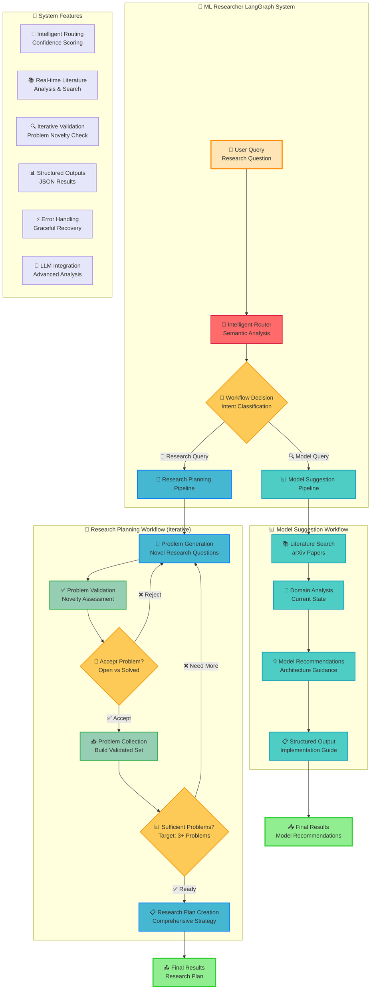
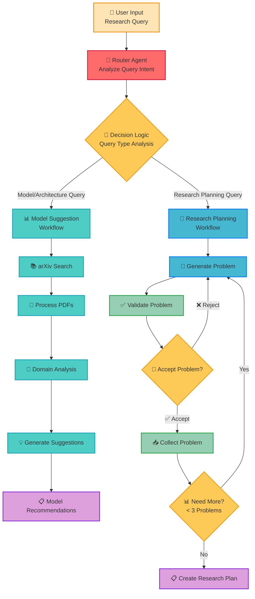
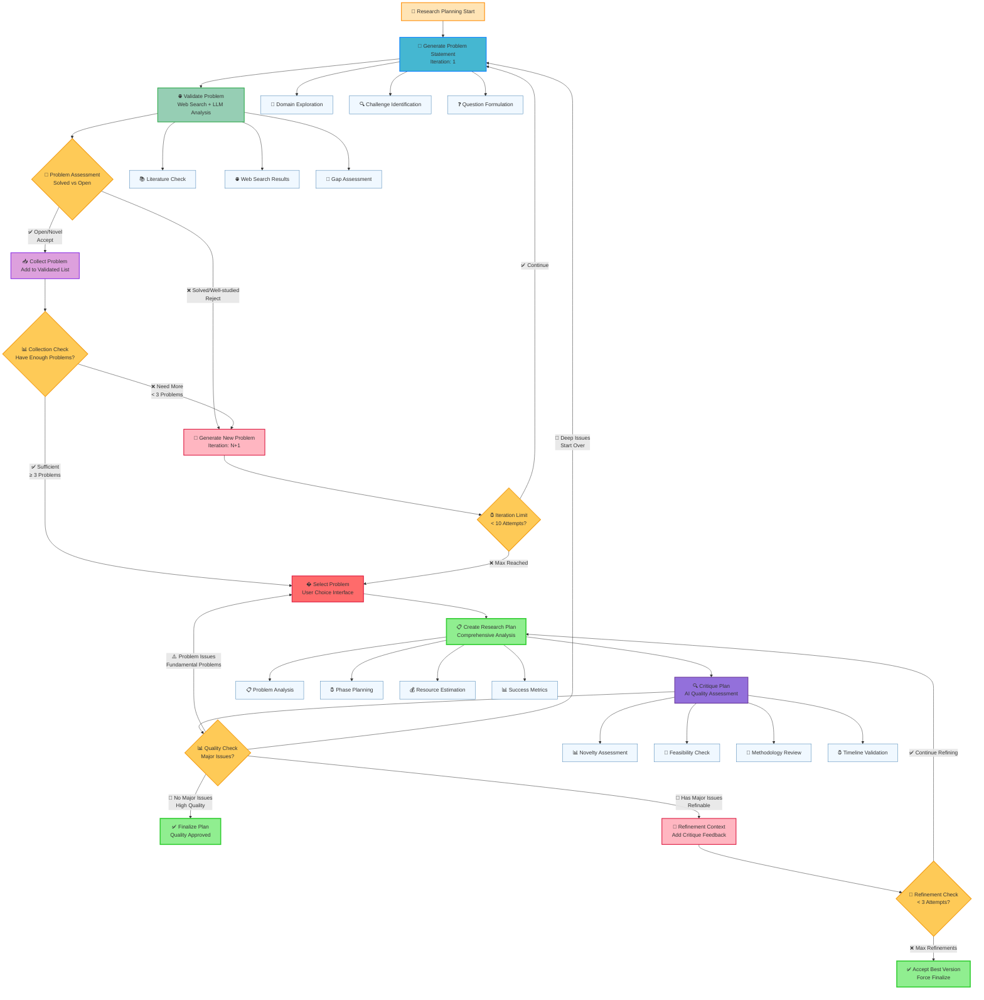
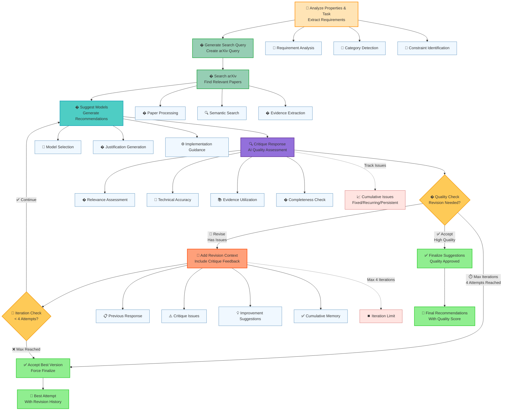

# ML Researcher LangGraph - Workflow Documentation

## 🌟 System Architecture Overview



## 🔀 Router & Workflow Decision Logic

The system intelligently routes user queries to the appropriate workflow:



## 🧪 Research Planning Workflow (Iterative)

The research planning workflow uses an iterative validation approach:



## 📊 Model Suggestion Workflow

For model recommendation queries:



## 📊 State Management & Data Flow

```mermaid
graph TD
    subgraph "📊 State Management System"
        A[🔄 RouterState<br/>Workflow Decision] --> B{🎯 Route Decision}
        B -->|Model Query| C[📊 ModelSuggestionState<br/>Literature Processing]
        B -->|Research Query| D[🧪 ResearchPlanningState<br/>Iterative Validation]
    end
    
    subgraph "📊 ModelSuggestionState Flow"
        C --> C1[📚 arXiv Results<br/>Papers & Content]
        C1 --> C2[🧠 Domain Analysis<br/>Research Landscape]
        C2 --> C3[💡 Model Suggestions<br/>Recommendations]
        C3 --> C4[📋 Final Output<br/>Structured Results]
    end
    
    subgraph "🧪 ResearchPlanningState Flow"
        D --> D1[🎯 Generated Problems<br/>All Attempts]
        D1 --> D2[✅ Current Problem<br/>Being Validated]
        D2 --> D3[🔍 Validation Results<br/>Accept/Reject Decision]
        D3 --> D4[📥 Validated Problems<br/>Accepted Collection]
        D4 --> D5[📊 Iteration Counter<br/>Progress Tracking]
        D5 --> D6[📋 Research Plan<br/>Final Strategy]
    end
    
    subgraph "🔍 Problem Validation Structure"
        E[🎯 Problem Statement] --> E1[📝 Description<br/>Detailed Context]
        E1 --> E2[❓ Research Question<br/>Specific Query]
        E2 --> E3[🏷️ Keywords<br/>Domain Tags]
        E3 --> E4[✅ Validation Result<br/>Status Assessment]
        
        E4 --> E5[📊 Status Classification<br/>solved|open|partial]
        E4 --> E6[🎯 Confidence Score<br/>0.0 - 1.0]
        E4 --> E7[💭 Reasoning<br/>Analysis Details]
        E4 --> E8[🔍 Existing Solutions<br/>Known Approaches]
        E4 --> E9[🎯 Research Gaps<br/>Open Opportunities]
        E4 --> E10[✅ Recommendation<br/>accept|reject]
    end
    
    %% Styling
    classDef state fill:#E6F3FF,stroke:#0066CC,stroke-width:2px
    classDef modelState fill:#E6F7FF,stroke:#00A0B0,stroke-width:2px
    classDef researchState fill:#E6F0FF,stroke:#4169E1,stroke-width:2px
    classDef validation fill:#F0FFF0,stroke:#228B22,stroke-width:2px
    classDef decision fill:#FFF8DC,stroke:#DAA520,stroke-width:2px
    classDef structure fill:#FFF0F5,stroke:#C71585,stroke-width:2px
    
    class A,B state
    class C,C1,C2,C3,C4 modelState
    class D,D1,D2,D3,D4,D5,D6 researchState
    class E,E1,E2,E3,E4 validation
    class B decision
    class E5,E6,E7,E8,E9,E10 structure
```

## ⚙️ Conditional Logic & Decision Points

```mermaid
graph TD
    subgraph "🔀 Router Logic Decision Tree"
        A[📝 User Query Analysis] --> B{🎯 Intent Detection<br/>Semantic Analysis}
        B -->|Model Keywords| C[🔍 MODEL_SUGGESTION<br/>Triggers Detected]
        B -->|Research Keywords| D[🔬 RESEARCH_PLANNING<br/>Triggers Detected]
        
        C --> C1[📊 Confidence: High<br/>Architecture Query]
        D --> D1[📊 Confidence: High<br/>Problem Discovery]
    end
    
    subgraph "🔄 Research Planning Conditional Logic"
        E[🎯 Problem Generation] --> F[✅ Problem Validation]
        F --> G{🤔 Validation Decision<br/>_check_completion()}
        
        G -->|recommendation: accept| H[📥 Collect Problem<br/>Add to Validated List]
        G -->|recommendation: reject| I[🔄 Continue Generation<br/>Loop Back]
        
        H --> J{📊 Collection Decision<br/>_should_continue_generating()}
        
        J -->|validated_problems < 3| K[🔄 Generate More<br/>Need Additional Problems]
        J -->|validated_problems >= 3| L[✅ Finalize Plan<br/>Sufficient Problems]
        J -->|iteration_count >= 10| M[⏰ Force Finalize<br/>Max Iterations Reached]
        
        I --> E
        K --> E
        L --> N[📋 Create Research Plan]
        M --> N
    end
    
    subgraph "🎯 Validation Assessment Logic"
        O[🔍 Problem Analysis] --> P{📊 Status Classification}
        
        P -->|Status: solved| Q[❌ REJECT<br/>Well Established]
        P -->|Status: well_studied| R[❌ REJECT<br/>Extensively Researched]
        P -->|Status: partially_solved| S{🎯 Confidence Check<br/>> 0.7?}
        P -->|Status: open| T[✅ ACCEPT<br/>Novel Opportunity]
        
        S -->|Yes| U[✅ ACCEPT<br/>Significant Gaps]
        S -->|No| V[❌ REJECT<br/>Low Confidence]
    end
    
    subgraph "⚙️ System Control Flow"
        W[🚀 System Start] --> X[🤖 Initialize Router]
        X --> Y[📝 Process User Query]
        Y --> Z{🎯 Route Decision}
        Z -->|Model| AA[📊 Execute Model Workflow]
        Z -->|Research| BB[🔬 Execute Research Workflow]
        AA --> CC[📤 Return Model Results]
        BB --> DD[📤 Return Research Results]
        CC --> EE[💾 Save & Display Results]
        DD --> EE
    end
    
    %% Styling
    classDef router fill:#FFE4E1,stroke:#DC143C,stroke-width:2px
    classDef research fill:#E0F6FF,stroke:#0080FF,stroke-width:2px
    classDef validation fill:#F0FFF0,stroke:#32CD32,stroke-width:2px
    classDef control fill:#F5F5DC,stroke:#8B4513,stroke-width:2px
    classDef decision fill:#FFFACD,stroke:#DAA520,stroke-width:2px
    classDef accept fill:#98FB98,stroke:#228B22,stroke-width:2px
    classDef reject fill:#FFB6C1,stroke:#DC143C,stroke-width:2px
    classDef process fill:#E6E6FA,stroke:#9370DB,stroke-width:2px
    
    class A,B,C,D,C1,D1 router
    class E,F,H,I,J,K,L,M,N research
    class O,P,S validation
    class W,X,Y,Z,AA,BB,CC,DD,EE control
    class B,G,J,P,S,Z decision
    class T,U accept
    class Q,R,V reject
    class A,E,F,H,O,AA,BB,CC,DD,N process
```

## 🎯 Key Features

- **🔀 Intelligent Routing**: Semantic analysis determines appropriate workflow
- **🧪 Iterative Validation**: Problems are validated for novelty before inclusion
- **📚 Real-time Literature Search**: Current arXiv papers inform recommendations
- **📊 Structured Outputs**: JSON results with confidence scoring
- **⚡ Error Handling**: Graceful recovery and fallback mechanisms

## 📝 Usage Examples

### Model Recommendation Query
```
"What model should I use for time series forecasting?"
→ Routes to Model Suggestion Workflow
→ Searches literature, analyzes domain, provides recommendations
```

### Research Planning Query  
```
"What are open problems in federated learning?"
→ Routes to Research Planning Workflow  
→ Generates problems, validates novelty, creates research plan
```
