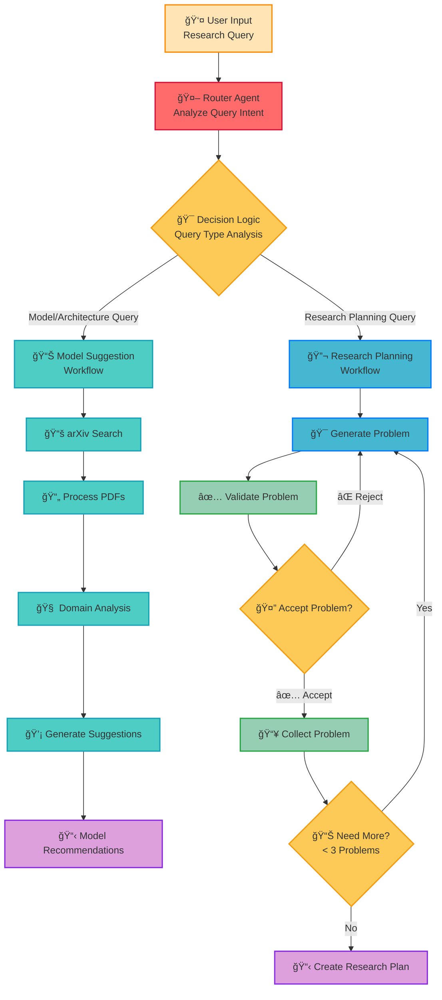

# ML Researcher LangGraph - Workflow Documentation

## 🌟 System Architecture Overview

```mermaid
graph TB
    subgraph "🌟 ML Researcher LangGraph System"
        A[👤 User Query<br/>Research Question] --> B[🤖 Intelligent Router<br/>Semantic Analysis]
        
        B --> C{🯠Workflow Decision<br/>Intent Classification}
        
        C -->|🔠Model Query| D[📊 Model Suggestion Pipeline]
        C -->|🔬 Research Query| E[🧪 Research Planning Pipeline]
    end
    
    subgraph "📊 Model Suggestion Workflow"
        D --> D1[📚 Literature Search<br/>arXiv Papers]
        D1 --> D2[🧠 Domain Analysis<br/>Current State]
        D2 --> D3[💡 Model Recommendations<br/>Architecture Guidance]
        D3 --> D4[📋 Structured Output<br/>Implementation Guide]
    end
    
    subgraph "🧪 Research Planning Workflow (Iterative)"
        E --> E1[🯠Problem Generation<br/>Novel Research Questions]
        E1 --> E2[✅ Problem Validation<br/>Novelty Assessment]
        E2 --> E3{🤔 Accept Problem?<br/>Open vs Solved}
        E3 -->|✅ Accept| E4[📥 Problem Collection<br/>Build Validated Set]
        E3 -->|⌠Reject| E1
        E4 --> E5{📊 Sufficient Problems?<br/>Target: 3+ Problems}
        E5 -->|⌠Need More| E1
        E5 -->|✅ Ready| E6[📋 Research Plan Creation<br/>Comprehensive Strategy]
    end
    
    subgraph "🯠System Features"
        F1[🔄 Intelligent Routing<br/>Confidence Scoring]
        F2[📚 Real-time Literature<br/>Analysis & Search]
        F3[🔠Iterative Validation<br/>Problem Novelty Check]
        F4[📊 Structured Outputs<br/>JSON Results]
        F5[âš¡ Error Handling<br/>Graceful Recovery]
        F6[🧠 LLM Integration<br/>Advanced Analysis]
    end
    
    D4 --> G[📤 Final Results<br/>Model Recommendations]
    E6 --> H[📤 Final Results<br/>Research Plan]
    
    %% Styling
    classDef userInput fill:#FFE4B5,stroke:#FF8C00,stroke-width:3px
    classDef router fill:#FF6B6B,stroke:#DC143C,stroke-width:2px
    classDef decision fill:#FECA57,stroke:#F39C12,stroke-width:2px
    classDef modelFlow fill:#4ECDC4,stroke:#17A2B8,stroke-width:2px
    classDef researchFlow fill:#45B7D1,stroke:#007BFF,stroke-width:2px
    classDef output fill:#90EE90,stroke:#32CD32,stroke-width:3px
    classDef features fill:#E6E6FA,stroke:#9370DB,stroke-width:1px
    classDef validation fill:#96CEB4,stroke:#28A745,stroke-width:2px
    
    class A userInput
    class B router
    class C,E3,E5 decision
    class D,D1,D2,D3,D4 modelFlow
    class E,E1,E2,E4,E6 researchFlow
    class E2,E4 validation
    class G,H output
    class F1,F2,F3,F4,F5,F6 features
```



## 🔀 Router & Workflow Decision Logic

The system intelligently routes user queries to the appropriate workflow:



## 🧪 Research Planning Workflow (Iterative)

The research planning workflow uses an iterative validation approach:

```mermaid
graph TD
    A[🔬 Research Planning Start] --> B[🎯 Generate Problem Statement<br/>Iteration: 1]
    
    B --> C[🔍 Validate Problem<br/>LLM Analysis]
    C --> D{🤔 Problem Assessment<br/>Solved vs Open}
    
    D -->|✅ Open/Novel<br/>Accept| E[📥 Collect Problem<br/>Add to Validated List]
    D -->|❌ Solved/Well-studied<br/>Reject| F[🔄 Generate New Problem<br/>Iteration: N+1]
    
    E --> G{📊 Collection Check<br/>Have Enough Problems?}
    G -->|❌ Need More<br/>< 3 Problems| F
    G -->|✅ Sufficient<br/>≥ 3 Problems| H[📋 Create Research Plan<br/>Comprehensive Analysis]
    
    F --> I{⏰ Iteration Limit<br/>< 10 Attempts?}
    I -->|✅ Continue| B
    I -->|❌ Max Reached| H
    
    H --> J[✅ Final Research Plan<br/>Validated Problems + Strategy]
    
    %% Validation Details
    C --> C1[📚 Literature Check]
    C --> C2[🧠 Solution Analysis]  
    C --> C3[🎯 Gap Assessment]
    
    %% Problem Generation Details
    B --> B1[💭 Domain Exploration]
    B --> B2[🔍 Challenge Identification]
    B --> B3[❓ Question Formulation]
    
    %% Research Plan Details
    H --> H1[📋 Problem Prioritization]
    H --> H2[⏰ Timeline Creation]
    H --> H3[💰 Resource Planning]
    H --> H4[📊 Success Metrics]
    
    %% Styling
    classDef start fill:#FFE4B5,stroke:#FF8C00,stroke-width:2px
    classDef process fill:#45B7D1,stroke:#007BFF,stroke-width:2px
    classDef validation fill:#96CEB4,stroke:#28A745,stroke-width:2px
    classDef decision fill:#FECA57,stroke:#F39C12,stroke-width:2px
    classDef collection fill:#DDA0DD,stroke:#8A2BE2,stroke-width:2px
    classDef output fill:#90EE90,stroke:#32CD32,stroke-width:3px
    classDef subprocess fill:#F0F8FF,stroke:#4682B4,stroke-width:1px
    classDef loop fill:#FFB6C1,stroke:#DC143C,stroke-width:2px
    
    class A start
    class B,F process
    class C validation
    class D,G,I decision
    class E collection
    class H,J output
    class B1,B2,B3,C1,C2,C3,H1,H2,H3,H4 subprocess
    class F loop
```



## 📊 Model Suggestion Workflow

For model recommendation queries:

```mermaid
graph TD
    A[🔍 Model Suggestion Start] --> B[📚 Search arXiv Papers<br/>Query Processing]
    
    B --> C[📄 Download & Process PDFs<br/>Extract Content]
    C --> D[🧹 Clean & Structure Data<br/>Remove Artifacts]
    D --> E[🧠 Domain Analysis<br/>Current State Assessment]
    E --> F[💡 Generate Model Suggestions<br/>Architecture Recommendations]
    F --> G[📊 Format Output<br/>Structured Results]
    
    %% Sub-processes
    B --> B1[🔑 Extract Keywords]
    B --> B2[🔍 arXiv API Query]
    B --> B3[📋 Filter Results]
    
    C --> C1[⬇️ Download PDFs]
    C --> C2[📖 Extract Text]
    C --> C3[🧹 Clean Content]
    
    E --> E1[📈 Analyze Trends]
    E --> E2[🎯 Identify Challenges]
    E --> E3[💪 Assess Strengths]
    
    F --> F1[🏗️ Architecture Options]
    F --> F2[⚖️ Performance Comparisons]
    F --> F3[🛠️ Implementation Guidance]
    
    G --> H[✅ Final Recommendations<br/>Complete Analysis]
    
    %% Styling
    classDef process fill:#4ECDC4,stroke:#17A2B8,stroke-width:2px
    classDef subprocess fill:#A8E6CF,stroke:#28A745,stroke-width:2px
    classDef output fill:#DDA0DD,stroke:#8A2BE2,stroke-width:2px
    
    class A,B,C,D,E,F,G process
    class B1,B2,B3,C1,C2,C3,E1,E2,E3,F1,F2,F3 subprocess
    class H output
```



## 📊 State Management & Data Flow

```mermaid
graph TD
    subgraph "📊 State Management System"
        A[🔄 RouterState<br/>Workflow Decision] --> B{🎯 Route Decision}
        B -->|Model Query| C[📊 ModelSuggestionState<br/>Literature Processing]
        B -->|Research Query| D[🧪 ResearchPlanningState<br/>Iterative Validation]
    end
    
    subgraph "📊 ModelSuggestionState Flow"
        C --> C1[📚 arXiv Results<br/>Papers & Content]
        C1 --> C2[🧠 Domain Analysis<br/>Research Landscape]
        C2 --> C3[💡 Model Suggestions<br/>Recommendations]
        C3 --> C4[📋 Final Output<br/>Structured Results]
    end
    
    subgraph "🧪 ResearchPlanningState Flow"
        D --> D1[🎯 Generated Problems<br/>All Attempts]
        D1 --> D2[✅ Current Problem<br/>Being Validated]
        D2 --> D3[🔍 Validation Results<br/>Accept/Reject Decision]
        D3 --> D4[📥 Validated Problems<br/>Accepted Collection]
        D4 --> D5[📊 Iteration Counter<br/>Progress Tracking]
        D5 --> D6[📋 Research Plan<br/>Final Strategy]
    end
    
    subgraph "🔍 Problem Validation Structure"
        E[🎯 Problem Statement] --> E1[📝 Description<br/>Detailed Context]
        E1 --> E2[❓ Research Question<br/>Specific Query]
        E2 --> E3[🏷️ Keywords<br/>Domain Tags]
        E3 --> E4[✅ Validation Result<br/>Status Assessment]
        
        E4 --> E5[📊 Status Classification<br/>solved|open|partial]
        E4 --> E6[🎯 Confidence Score<br/>0.0 - 1.0]
        E4 --> E7[💭 Reasoning<br/>Analysis Details]
        E4 --> E8[🔍 Existing Solutions<br/>Known Approaches]
        E4 --> E9[🎯 Research Gaps<br/>Open Opportunities]
        E4 --> E10[✅ Recommendation<br/>accept|reject]
    end
    
    %% Styling
    classDef state fill:#E6F3FF,stroke:#0066CC,stroke-width:2px
    classDef modelState fill:#E6F7FF,stroke:#00A0B0,stroke-width:2px
    classDef researchState fill:#E6F0FF,stroke:#4169E1,stroke-width:2px
    classDef validation fill:#F0FFF0,stroke:#228B22,stroke-width:2px
    classDef decision fill:#FFF8DC,stroke:#DAA520,stroke-width:2px
    classDef structure fill:#FFF0F5,stroke:#C71585,stroke-width:2px
    
    class A,B state
    class C,C1,C2,C3,C4 modelState
    class D,D1,D2,D3,D4,D5,D6 researchState
    class E,E1,E2,E3,E4 validation
    class B decision
    class E5,E6,E7,E8,E9,E10 structure
```

## ⚙️ Conditional Logic & Decision Points

```mermaid
graph TD
    subgraph "🔀 Router Logic Decision Tree"
        A[📝 User Query Analysis] --> B{🎯 Intent Detection<br/>Semantic Analysis}
        B -->|Model Keywords| C[🔍 MODEL_SUGGESTION<br/>Triggers Detected]
        B -->|Research Keywords| D[🔬 RESEARCH_PLANNING<br/>Triggers Detected]
        
        C --> C1[📊 Confidence: High<br/>Architecture Query]
        D --> D1[📊 Confidence: High<br/>Problem Discovery]
    end
    
    subgraph "🔄 Research Planning Conditional Logic"
        E[🎯 Problem Generation] --> F[✅ Problem Validation]
        F --> G{🤔 Validation Decision<br/>_check_completion()}
        
        G -->|recommendation: accept| H[📥 Collect Problem<br/>Add to Validated List]
        G -->|recommendation: reject| I[🔄 Continue Generation<br/>Loop Back]
        
        H --> J{📊 Collection Decision<br/>_should_continue_generating()}
        
        J -->|validated_problems < 3| K[🔄 Generate More<br/>Need Additional Problems]
        J -->|validated_problems >= 3| L[✅ Finalize Plan<br/>Sufficient Problems]
        J -->|iteration_count >= 10| M[⏰ Force Finalize<br/>Max Iterations Reached]
        
        I --> E
        K --> E
        L --> N[📋 Create Research Plan]
        M --> N
    end
    
    subgraph "🎯 Validation Assessment Logic"
        O[🔍 Problem Analysis] --> P{📊 Status Classification}
        
        P -->|Status: solved| Q[❌ REJECT<br/>Well Established]
        P -->|Status: well_studied| R[❌ REJECT<br/>Extensively Researched]
        P -->|Status: partially_solved| S{🎯 Confidence Check<br/>> 0.7?}
        P -->|Status: open| T[✅ ACCEPT<br/>Novel Opportunity]
        
        S -->|Yes| U[✅ ACCEPT<br/>Significant Gaps]
        S -->|No| V[❌ REJECT<br/>Low Confidence]
    end
    
    subgraph "⚙️ System Control Flow"
        W[🚀 System Start] --> X[🤖 Initialize Router]
        X --> Y[📝 Process User Query]
        Y --> Z{🎯 Route Decision}
        Z -->|Model| AA[📊 Execute Model Workflow]
        Z -->|Research| BB[🔬 Execute Research Workflow]
        AA --> CC[📤 Return Model Results]
        BB --> DD[📤 Return Research Results]
        CC --> EE[💾 Save & Display Results]
        DD --> EE
    end
    
    %% Styling
    classDef router fill:#FFE4E1,stroke:#DC143C,stroke-width:2px
    classDef research fill:#E0F6FF,stroke:#0080FF,stroke-width:2px
    classDef validation fill:#F0FFF0,stroke:#32CD32,stroke-width:2px
    classDef control fill:#F5F5DC,stroke:#8B4513,stroke-width:2px
    classDef decision fill:#FFFACD,stroke:#DAA520,stroke-width:2px
    classDef accept fill:#98FB98,stroke:#228B22,stroke-width:2px
    classDef reject fill:#FFB6C1,stroke:#DC143C,stroke-width:2px
    classDef process fill:#E6E6FA,stroke:#9370DB,stroke-width:2px
    
    class A,B,C,D,C1,D1 router
    class E,F,H,I,J,K,L,M,N research
    class O,P,S validation
    class W,X,Y,Z,AA,BB,CC,DD,EE control
    class B,G,J,P,S,Z decision
    class T,U accept
    class Q,R,V reject
    class A,E,F,H,O,AA,BB,CC,DD,N process
```

## 🎯 Key Features

- **🔀 Intelligent Routing**: Semantic analysis determines appropriate workflow
- **🧪 Iterative Validation**: Problems are validated for novelty before inclusion
- **📚 Real-time Literature Search**: Current arXiv papers inform recommendations
- **📊 Structured Outputs**: JSON results with confidence scoring
- **⚡ Error Handling**: Graceful recovery and fallback mechanisms

## 📝 Usage Examples

### Model Recommendation Query
```
"What model should I use for time series forecasting?"
→ Routes to Model Suggestion Workflow
→ Searches literature, analyzes domain, provides recommendations
```

### Research Planning Query  
```
"What are open problems in federated learning?"
→ Routes to Research Planning Workflow  
→ Generates problems, validates novelty, creates research plan
```
